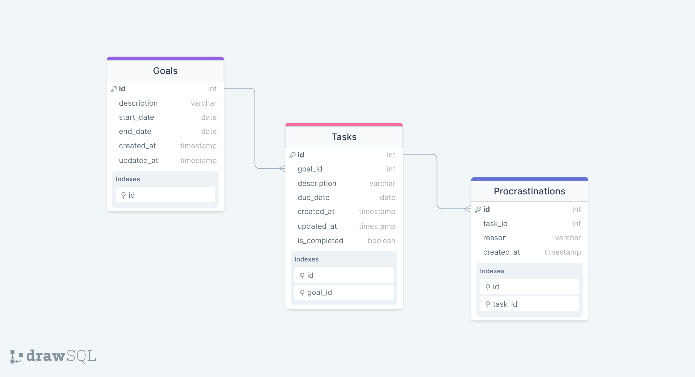

# Procket Backend
The backend for 
<a href="https://procket.vercel.app/" target="_blank">Procket</a>
is responsible for managing the goals, tasks, and procrastination data. It provides a RESTful API that 
<a href="https://github.com/BehinaBhr/behina-bahramsari-procket" target="_blank">the frontend</a> can interact with. It is hosted on <a href="https://procket-api-3be725e5d749.herokuapp.com" target="_blank">Heroku</a>.

## Setup and Running

- Clone the repository:

   ```bash
  git clone https://github.com/BehinaBhr/behina-bahramsari-procket-api.git
   ``` 

- Install dependencies:

   ```bash
    npm install
   ``` 

- Create a `.env` file like the sample provided and set up your environment variables.

- Run migrations:

   ```bash
    npx knex migrate:latest
   ``` 

- Seed the database:

   ```bash
    npx knex seed:run
   ``` 

- Start the server:

   ```bash
    npm run start
   ``` 
## Tech Stack

- Backend Framework:

  - **Express.js** (**Node.js**) with **knex** for database operations.

- Database:

  - Use a relational database **MySQL** for goals and tasks information, procrastinations logs.

## Data Schema



## Endpoints

**Base URL**

- http://localhost:5001/api

**GET /goals**

- Retrieve all goals sorted in ascending order, first by their progress percentage, and then, in case of a tie, by their end date.
- Response:
  - Status Code: 200 OK
  - Body:
    ```
    [
        {
            "id": 3,
            "description": "Learn French",
            "start_date": "2024-03-01",
            "end_date": "2024-03-31",
            "progress": 0,
            "procrastinations": 2
        },
        {
            "id": 2,
            "description": "Read 5 books",
            "start_date": "2024-03-01",
            "end_date": "2024-03-31",
            "progress": 40,
            "procrastinations": 5
        }
    ]
    ```

**POST /goals**

- Create a new goal with the following parameters:
  - description (string): Description of the goal.
  - startDate (date): Start date of the goal.
  - endDate (date): End date of the goal.
- Request Body:
  {
  "description": "New Goal for test",
  "start_date": "2024-04-06",
  "end_date": "2024-04-12"
  }
- Response:
  - Status Code: 201 Created
  - Body:
    ```
    {
        "id": 33,
        "description": "New Goal for test",
        "start_date": "2024-04-06",
        "end_date": "2024-04-12",
        "progress": 0
    }
    ```

**GET /goals/{goalId}**

- Retrieve a specific goal with a given goalId like 1.
- Response:
  - Status Code: 200 Created
  - Body:
    ```
    {
        "id": 1,
        "description": "Finish Procket project",
        "start_date": "2024-03-18",
        "end_date": "2024-04-06",
        "progress": 66.67
    }
    ```

**PUT /goals/{goalId}**

- Update an existing goal with the following parameters:
  - goalId (integer): Identifier of the goal to update.
  - Any goal attributes to update.
- Request Body: (Attributes to update)
  ```
    {
        "description": "Update New Goal for test",
        "start_date": "2024-04-15",
        "end_date": "2024-04-30"
    }
  ```
- Response:
  - Status Code: 200 OK
  - Body:
    ```
    {
        "id": 33,
        "description": "Update New Goal for test",
        "start_date": "2024-04-15",
        "end_date": "2024-04-30",
        "progress": 0
    }
    ```

**DELETE /goals/{goalId}**

- Delete a goal with the following parameters:
  - goalId (integer): Identifier of the goal to delete.
- Response:
  - Status Code: 204 No Content

**GET /goals/{goalId}/tasks**

- Retrieve all procrastination count associated with a specific goal (goalId: 1).
- Response:
  - Status Code: 200 OK
  - Body:
    ```
    [
        {
            "id": 7,
            "goal_id": 1,
            "description": "Implement authentication feature",
            "is_completed": 0,
            "due_date": "2024-04-01",
            "procrastinations": 3
        },
        {
            "id": 1,
            "goal_id": 1,
            "description": "Complete frontend development",
            "is_completed": 1,
            "due_date": "2024-04-06",
            "procrastinations": 3
        }
    ]
    ```

**GET /goals/{goalId}/procrastinations**

- Retrieve all procrastinations associated with a specific goal (goalId: 1), sorted by ascending due date. Upcoming due dates are displayed first, followed by past ones.
- Response:
  - Status Code: 200 OK
  - Body:
    ```
    {
        "No rush, plenty of time": 1,
        "Forgetting": 3,
        "Not being in the mood": 1,
        "Delaying one task to perfect another": 1,
        "Sickness or poor health": 1
    }
    ```

**GET /tasks**

- Retrieve all tasks sorted by ascending due date, starting with upcoming tasks followed by past ones.
- Response:
  - Status Code: 200 OK
  - Body:
    ```
    [
        {
            "id": 11,
            "goal_id": 3,
            "goal_description": "Learn French",
            "description": "Watch French movies with subtitles",
            "is_completed": 0,
            "due_date": "2024-03-20"
        },
        {
            "id": 8,
            "goal_id": 2,
            "goal_description": "Read 5 books",
            "description": "Read 'The Great Gatsby' by F. Scott Fitzgerald",
            "is_completed": 0,
            "due_date": "2024-03-25"
        },
    ]
    ```

**POST /tasks**

- Create a new task with the following parameters:
  - goalId (integer): Identifier of the associated goal.
  - description (string): Description of the task.
  - due_date(date): Due date of the task.
- Request Body:
  ```
  {
      "goal_id": "33",
      "description": "New task for test",
      "due_date": "2024-04-18",
  }
  ```
- Response:
  - Status Code: 201 Created
  - Body:
    ````
    {
        "id": 45,
        "goal_id": 33,
        "goal_description": "Update New Goal for test",
        "description": "New task for test",
        "is_completed": 0,
        "due_date": "2024-04-18"
    }
    ```
    ````

**GET /tasks/past**

- Retrieve all tasks which are later than today's past ones.
- Response:
  - Status Code: 200 OK
  - Body:
    ```
    {
        "id": 11,
        "goal_id": 3,
        "goal_description": "Learn French",
        "description": "Watch French movies with subtitles",
        "is_completed": 0,
        "due_date": "2024-03-20"
    },
    {
        "id": 8,
        "goal_id": 2,
        "goal_description": "Read 5 books",
        "description": "Read 'The Great Gatsby' by F. Scott Fitzgerald",
        "is_completed": 0,
        "due_date": "2024-03-25"
    },
    ```

**GET /tasks/on-going**

- Retrieve a specific goal with a given goalId like 1.
- Response:
  - Status Code: 200 Created
  - Body:
    ```
    [
    {
        "id": 7,
        "goal_id": 1,
        "goal_description": "Finish Procket project",
        "description": "Implement authentication feature",
        "is_completed": 0,
        "due_date": "2024-04-01"
    }
    ]
    ```

**GET /tasks/{taskId}**

- Retrieve a specific task with a given taskId like 1.
- Response:
  - Status Code: 200 Created
  - Body:
    ```
    {
        "id": 1,
        "goal_id": 1,
        "goal_description": "Finish Procket project",
        "description": "Complete frontend development",
        "is_completed": 1,
        "due_date": "2024-04-06"
    }
    ```

**PUT /tasks/{taskId}**

- Update an existing task with the following parameters:
  - taskId (integer): Identifier of the task to update like 33
  - Any task attributes to update except for _created_at_ and _updated_at_.
- Request Body:
  ```
  {
      "description": "Update New task for test",
      "due_date": "2024-04-19",
      "is_completed": 1
  }
  ```
- Response:
  - Status Code: 201 Created
  - Body:
    ````
    {
        "id": 45,
        "goal_id": 33,
        "goal_description": "Update New Goal for test",
        "description": "Update New task for test",
        "is_completed": 1,
        "due_date": "2024-04-19"
    }
    ```
    ````

**DELETE /tasks/{taskId}**

- Delete a task with the following parameters:
  - taskId (integer): Identifier of the task to delete.
- Response:
  - Status Code: 204 No Content

**GET /tasks/{taskId}/procrastinations**

- Retrieve a list of associated procrastinations of a specific task with a given taskId like 1 .
- Response:

  - Status Code: 200 OK
  - Body:

    ```
    [
        {
            "id": 1,
            "task_id": 1,
            "reason": "No rush, plenty of time",
            "created_at": "2024-04-01 00:05:03"
        },
        {
            "id": 2,
            "task_id": 1,
            "reason": "Forgetting",
            "created_at": "2024-04-01 00:05:03"
        },
    ]
    ```

    **GET /tasks/{taskId}/procrastinations/grouped**

- Retrieve the total associated procrastination reason count of a specific task with a given taskId like 1.
- Response:
  - Status Code: 200 OK
  - Body:
    ```
    {
        "No rush, plenty of time": 1,
        "Forgetting": 1,
        "Not being in the mood": 1
    }
    ```

**POST /procrastinations**

- Create a new procrastination with the following parameters:
  - task_id (string): associated task id.
  - reason (string): one of the following options ("Not being in the mood", "No rush, plenty of time", "Nothing bad will happen", "No motivation", "Forgetting", "Sickness or poor health", "Overthinking the task", "Delaying one task to perfect another")
- Request Body:
  ```
  {
      "task_id": 45,
      "reason": "Forgetting"
  }
  ```
- Response:
  - Status Code: 201 Created
  - Body:
    ```
    {
        "id": 31,
        "task_id": 45,
        "reason": "Forgetting",
        "created_at": "2024-04-01 11:40:13"
    }
    ```

**Get /procrastinations/grouped**

- Retrieve all procrastination's reason count.
- Response:
  - Status Code: 200 OK
  - Body:
    ```
    {
        "No rush, plenty of time": 2,
        "Forgetting": 6,
        "Not being in the mood": 5,
        "Sickness or poor health": 4,
        "Nothing bad will happen": 3,
        "Overthinking the task": 2,
        "Delaying one task to perfect another": 2
    }
    ```

**DELETE /procrastinations/{procrastinationId}**

- Delete a task with the following parameters:
  - procrastinationId (integer): Identifier of the associate procrastination to delete.
- Response:
  - Status Code: 204 No Content

**Get /rockets**

- Retrieve all rocket images based on the number of completed goals.
- Response:
  - Status Code: 200 OK
  - Body:
    ```
    [
        "images/rocket-1.png",
        "images/rocket-2.png"
    ]
    ```
## Takeaways and Improvements

From this project, I have learned about building a RESTful API with Node.js and Express.js, as well as using Knex.js for database operations.
Moving forward, I plan to implement more comprehensive error handling and logging to improve the robustness of the backend.

## Resources

- [Frontend Repository](<https://github.com/BehinaBhr/behina-bahramsari-procket>)
- [Procket](<https://procket.vercel.app/>)

## Feedback and Support

Whether you have ideas to share, suggestions for improvement, or questions about the project, I'd love to hear from you! Your feedback is incredibly valuable to me.

[](https://www.linkedin.com/in/behinabahramsari/) 
[](mailto:mail@behinabahramsari@gmail.com) 
[](https://www.instagram.com/be_bhr/) 
[](https://behinabhr.github.io/)